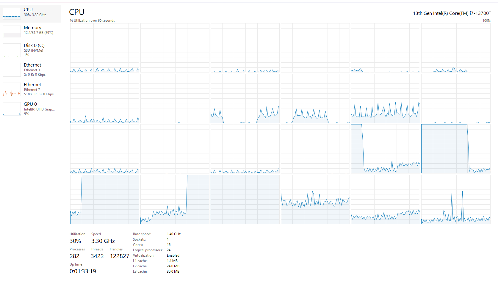
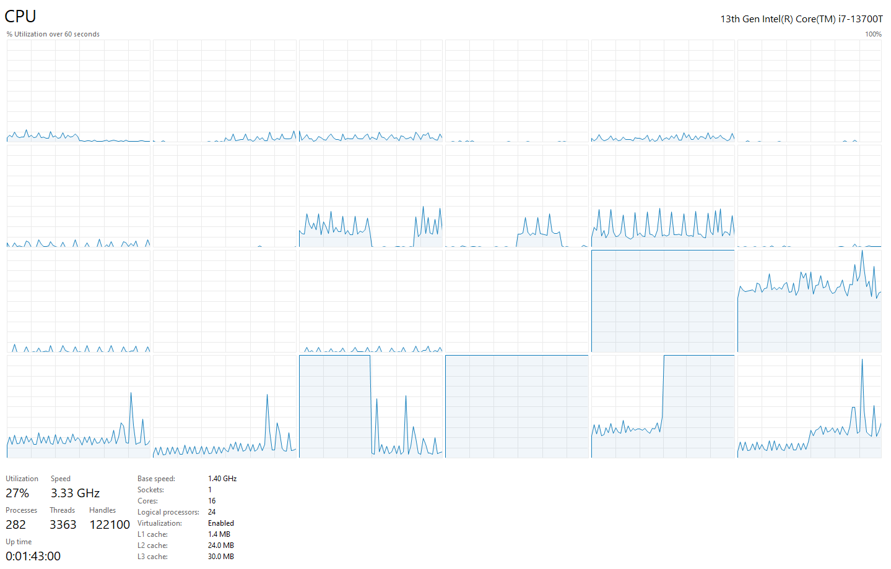

Escuela Colombiana de Ingeniería

Arquitecturas de Software – ARSW
-  Jeimy Yaya


## Parte I 

Creación, puesta en marcha y coordinación de hilos.

1. Revise el programa “primos concurrentes” (en la carpeta parte1), dispuesto en el paquete edu.eci.arsw.primefinder. Este es un programa que calcula los números primos entre dos intervalos, distribuyendo la búsqueda de los mismos entre hilos independientes. Por ahora, tiene un único hilo de ejecución que busca los primos entre 0 y 30.000.000. Ejecútelo, abra el administrador de procesos del sistema operativo, y verifique cuantos núcleos son usados por el mismo.   

- Podemos evidenciar que se estan usando 4 núcleos al ejecutar el proceso. (Cuando uno de los nucleos baja otro lo sustituye, por eso son 4)
<p align="center">

</p>


2. Modifique el programa para que, en lugar de resolver el problema con un solo hilo, lo haga con tres, donde cada uno de éstos hará la tarcera parte del problema original. Verifique nuevamente el funcionamiento, y nuevamente revise el uso de los núcleos del equipo.

```
public class Main {

	public static void main(String[] args) {
		int max = 500000000;
        int part = max / 3;

        PrimeFinderThread pft1 = new PrimeFinderThread(0, part);
        PrimeFinderThread pft2 = new PrimeFinderThread(part + 1, 2 * part);
        PrimeFinderThread pft3 = new PrimeFinderThread(2 * part + 1, max);

        // Iniciar los tres hilos
        pft1.start();
        pft2.start();
        pft3.start();
    }
	
}
```

- En este caso también se evidencia el uso de 4 núcleos.   
<p align="center">

</p>   


3. Lo que se le ha pedido es: debe modificar la aplicación de manera que cuando hayan transcurrido 5 segundos desde que se inició la ejecución, se detengan todos los hilos y se muestre el número de primos encontrados hasta el momento. Luego, se debe esperar a que el usuario presione ENTER para reanudar la ejecución de los mismo.

- Se añadió un atributo para determinar cuando pausar los hilos. Luego se editó el metodo **run()** para que se valide si el hilo esta "pausado". Finalmente se crean los metodos **pauseThread()** y **resumeThread()** para pausar y reanudar los hilos:

```
public PrimeFinderThread(int a, int b) {
		super();
		this.a = a;
		this.b = b;
		this.paused = false;
	}

	public void run(){

		for (int i=a;i<=b;i++){	
			synchronized (this) {
				while (paused) {
					try {
						wait();
					} catch (InterruptedException e) {
						e.printStackTrace();
					}
				}
			}				
			if (isPrime(i)){
				primes.add(i);
				System.out.println(i);
			}
		}
	}


	public void pauseThread(){
		paused = true;

	}

	public void resumeThread() {
        paused = false;
        synchronized (this) {
            notify();
	}
```
- En la clase main generamos un ciclo para que cada 5 segundos los hilos se pausen y cuando se oprima **ENTER** reanuden:
```
public static void main(String[] args) throws InterruptedException {
		int max = 500000000;
        int part = max / 3;

        PrimeFinderThread pft1 = new PrimeFinderThread(0, part);
        PrimeFinderThread pft2 = new PrimeFinderThread(part + 1, 2 * part);
        PrimeFinderThread pft3 = new PrimeFinderThread(2 * part + 1, max);

        pft1.start();
        pft2.start();
        pft3.start();

		Scanner scanner = new Scanner(System.in);
		
		while (pft1.isAlive() || pft2.isAlive() || pft3.isAlive()) {
			Thread.sleep(5000);
			pft1.pauseThread();
			pft2.pauseThread();
			pft3.pauseThread();

			String input = scanner.nextLine();

			if (input.isEmpty()){
				pft1.resumeThread();
				pft2.resumeThread();
				pft3.resumeThread();
			}
		}	

    }
```

## Parte II 

Para este ejercicio se va a trabajar con un simulador de carreras de galgos (carpeta parte2), cuya representación gráfica corresponde a la siguiente figura:


En la simulación, todos los galgos tienen la misma velocidad (a nivel de programación), por lo que el galgo ganador será aquel que (por cuestiones del azar) haya sido más beneficiado por el *scheduling* del
procesador (es decir, al que más ciclos de CPU se le haya otorgado durante la carrera). El modelo de la aplicación es el siguiente:


Como se observa, los galgos son objetos ‘hilo’ (Thread), y el avance de los mismos es visualizado en la clase Canodromo, que es básicamente un formulario Swing. Todos los galgos (por defecto son 17 galgos corriendo en una pista de 100 metros) comparten el acceso a un objeto de tipo
RegistroLLegada. Cuando un galgo llega a la meta, accede al contador ubicado en dicho objeto (cuyo valor inicial es 1), y toma dicho valor como su posición de llegada, y luego lo incrementa en 1. El galgo que
logre tomar el ‘1’ será el ganador.

Al iniciar la aplicación, hay un primer error evidente: los resultados (total recorrido y número del galgo ganador) son mostrados antes de que finalice la carrera como tal. Sin embargo, es posible que una vez corregido esto, haya más inconsistencias causadas por la presencia de condiciones de carrera.

Taller.

1.  Corrija la aplicación para que el aviso de resultados se muestre
    sólo cuando la ejecución de todos los hilos ‘galgo’ haya finalizado.
    Para esto tenga en cuenta:

    a.  La acción de iniciar la carrera y mostrar los resultados se realiza a partir de la línea 38 de MainCanodromo.

    b.  Puede utilizarse el método join() de la clase Thread para sincronizar el hilo que inicia la carrera, con la finalización de los hilos de los galgos.

2.  Una vez corregido el problema inicial, corra la aplicación varias
    veces, e identifique las inconsistencias en los resultados de las
    mismas viendo el ‘ranking’ mostrado en consola (algunas veces
    podrían salir resultados válidos, pero en otros se pueden presentar
    dichas inconsistencias). A partir de esto, identifique las regiones
    críticas () del programa.

3.  Utilice un mecanismo de sincronización para garantizar que a dichas
    regiones críticas sólo acceda un hilo a la vez. Verifique los
    resultados.

4.  Implemente las funcionalidades de pausa y continuar. Con estas,
    cuando se haga clic en ‘Stop’, todos los hilos de los galgos
    deberían dormirse, y cuando se haga clic en ‘Continue’ los mismos
    deberían despertarse y continuar con la carrera. Diseñe una solución que permita hacer esto utilizando los mecanismos de sincronización con las primitivas de los Locks provistos por el lenguaje (wait y notifyAll).


## Criterios de evaluación

1. Funcionalidad.

    1.1. La ejecución de los galgos puede ser detenida y resumida consistentemente.
    
    1.2. No hay inconsistencias en el orden de llegada registrado.
    
2. Diseño.   

    2.1. Se hace una sincronización de sólo la región crítica (sincronizar, por ejemplo, todo un método, bloquearía más de lo necesario).
    
    2.2. Los galgos, cuando están suspendidos, son reactivados son sólo un llamado (usando un monitor común).

